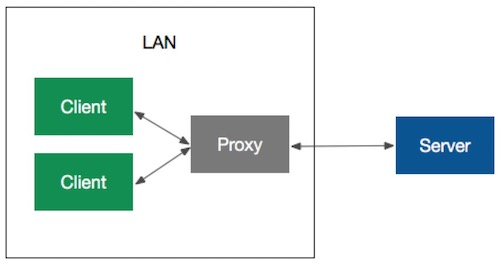
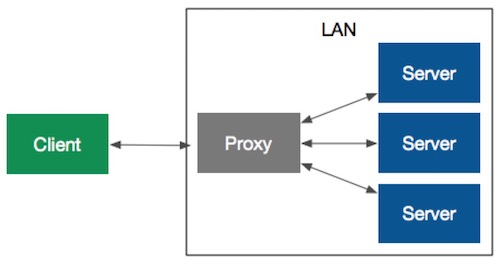

代理(英语: Proxy)，就是双方不直接交互，而是通过一个中间角色间接交互，这个中间角色就是代理。Web中经常提到的代理有正向代理(Forward Proxy)和反向代理(Reverse Proxy)，这篇文章主要描述了这两种代理的区别，以及他们的用途。

<!--more-->

### 正向代理

通常大家说的代理就是指，正向代理。就是指客户端不直接发送请求给目标服务器，而是直接请求代理服务器，由代理服务器和目标服务器进行交互,并把结果返回给客户端。客户端通常需要配置自己的代理服务器，即客户端知道自己请求的是代理。在这种模式下，代理服务器是客户端的代理。

正向代理的作用：
- 突破访问限制。让防火墙内的局域网客户端能够访问外网，所谓翻墙。
- 隐藏客户端。一般来说，代理都有隐藏终端的作用，这样可以保障安全和隐私。
- 加速访问。这个也很好理解，让我想起了单源最短路里的松弛操作。
- 缓存数据。这个是充分挖掘了代理服务器的作用，在一条通信链中尽快返回结果。
- 访问控制。对内网中的资源请求进行控制，通常配合VPN使用。

### 正向代理

反向代理和正向代理非常类似，但是也有很明显的区别。相同的地方是指客户端同样不直接发送请求给真正处理请求的目标服务器，而是直接请求代理服务器，由代理服务器和目标服务器进行交互,并把结果返回给客户端。它和正向代理的区别是，客户端并不知道处理自己请求的是代理代理服务器，客户端始终认为自己在跟目标服务器交互，可见真正处理请求的服务器是对客户端不可见的。在这种模式下，代理服务器是目标服务器的代理。

反向代理的作用：
- 暴露服务。将防火墙后边的服务器提供给外网访问。
- 保护和隐藏原始服务器。直接暴露在公网会有安全隐患，可以在内网中设置防火墙，只处理来自代理服务器的请求。
- 负载均衡。代理服务器的位置非常适合做这件事情。
- 流量控制。代理服务器可以缓冲上传、缓冲请求，来保证后端服务器能够正常处理请求。

### 参考
1. [代理服务器](https://zh.wikipedia.org/wiki/%E4%BB%A3%E7%90%86%E6%9C%8D%E5%8A%A1%E5%99%A8)
2. [图解正向代理、反向代理、透明代理](http://z00w00.blog.51cto.com/515114/1031287)
