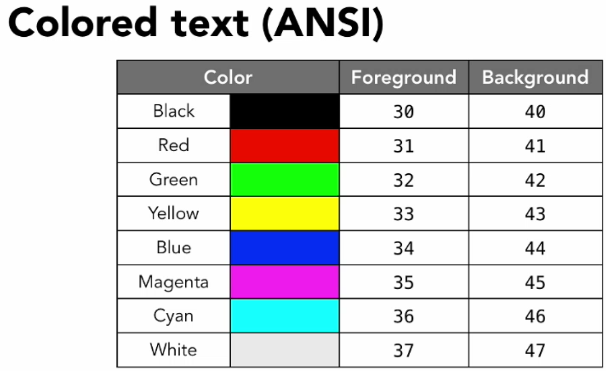
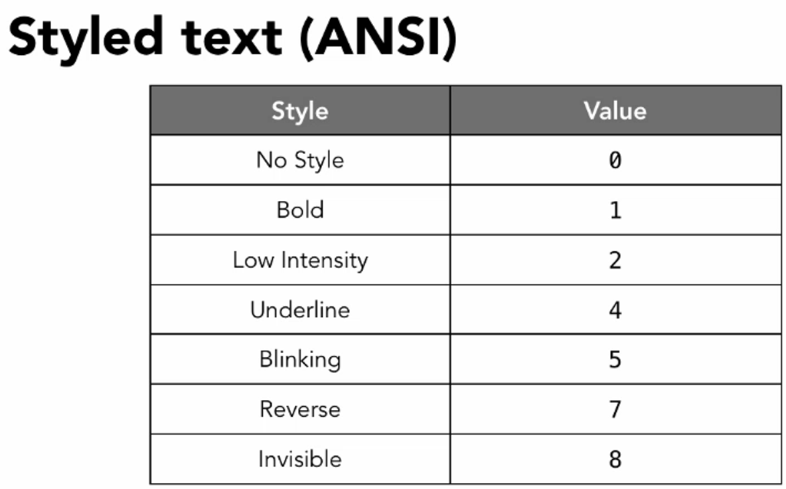

echo 是一个shell内置的用于打印文本的基本命令，可以将内容打印到屏幕上。

<!--more-->

### 说明

echo 的内容不用引号包括时，每一段内容会用空格（可能是IFS变量在起作用）合并起来。也可以用分号或者换行符表示结束，但是这种方法有一个不足的地方就是不能打印分号本身，也不能打印多个连续的空格。
希望原样输出内容时，可以用双引号或者单引号括起来，他们的区别是单引号不会拓展变量。

### 命令用法

```shell
echo -eEn [arg ...]
```

### 常用选项

-n
默认会在所有内容后再加一个换行符，一起打印到屏幕上，这个选项会阻止加入换行符。

-e
默认原样输出，即不会对转义字符进行转义。加入这个选项后会对转义字符进行转义

-E 
有的系统是默认启用转义的。这个选项强制指定不需要转义。

补一个常见转义字符的列表：

转移字符 | 含义 
--------|------
`\e, \E`| 转义
`\\`    | 反斜杠
`\a`    | 警告，会有蜂鸣声
`\b`    | 退格键
`\n`    | 换行
`\r`    | 回车键
`\t, \v`| 水平制表符，垂直制表符 
`\0nnn` | 八进制表示的Ascii符
`\xhh`  | 16进制表示的Ascii符
`\uxxxx`| 表示Unicode码

### 补充

echo 也可以做一些简单的样式控制，虽然比不上 print 那么强大，但也是足够*精彩*：echo 可以打印出不同颜色的字体。

格式是：`<esc>[<format-code>m<output>`

`<esc>` 就是键盘左上角的那个按键，用转义字符 \e 表示，ascii码是 \033 \x1b。看来这个字符的初衷，是转义相关的操作，而不是退出取消。
`<format-code>` 是对字符样式的控制码，比如字体颜色、背景颜色、动画等。格式是 `<style-code>[;<foreground-code>[;<background-code>]]` 其中后两部分代码是可选的。

设置某种格式之后，接下来终端里所有打印出的字符都会遵守控制。注意 [和m中间不能有空格
比如:

```
echo -e "\e[32m我是绿色的字\e[0m我是正常颜色的字"
```

直观的颜色：




#### 两个有意思的脚本
这个告诉我们，原来可以这样用变量设置颜色
```bash
#! /usr/bin/bash
RED='\033[0;31m'
NC='\033[0m' # No Color
printf "I ${RED}love${NC} Stack Overflow\n"
```

这个脚本取名叫万花筒？
```bash
#! /usr/bin/bash
for code in {0..255}; do echo -e "\e[38;05;${code}m $code: Test"; done
for code in {30..49}; do echo -e "$i = \e[0;$[i++]m test color \e[m";done
```

### 参考

<http://misc.flogisoft.com/bash/tip_colors_and_formatting>
