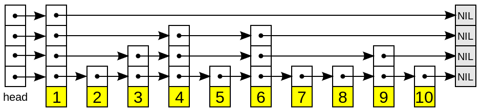

之前介绍过，Redis提供的数据类型有五种：字符串、列表、字典、集合、有序集合，而且每一种数据类型又由至少两种不同的底层实现，这篇文章主要想讲每种数据类型是怎么实现的以及为什么要这样做。

<!--more-->

## 先说为什么

下面这个表展示了，我们直接使用的数据类型都有哪些不同的底层实现。

对外提供的数据类型 | 底层的实现方式
------------------|---------------
字符串            | int, raw, embstr
列表              | linkedlist, ziplist
字典              | hashtable, ziplist
集合              | hashtable, intset
有序集合          | ziplist, skiplist

为什么Redis会这样做？目的之一是为了**在不同的使用场景下，都尽可能的获得更好的效率**。就好像我们实现数组可以用顺序表也可以用链表，如果查询多就选顺序表实现，如果新增删除操作多就选链表。Redis的这一做法应该是一种策略模式的实现。

## Redis中的数据类型

### 字符串

字符串是Redis中最最基本的数据类型，除了狭义的字符串，这里的字符串也能存储二进制数据，当成字节串就行了。字符串键的值做大允许512MB。

Redis字符串的有三种实现方式：

- int： 如果一个字符串内容是一个long范围内的整数值，那这个字符串实际上就会存一个整数，并做标记。标记的作用可以认为是对外展现时，会做符合字符串使用要求的转换。
- raw：如果一个字符串保存的是大于32字节的字符串内容(即非整数)，那这个字符串就用一个SDS，也就是简单动态字符串来保存。
- embstr：如果一个字符串保存的是32字节以内的字符串内容(即非整数)，这个字符串也用一个SDS表示，但是他相比raw，使用了固定长度的一段 **连续的** 内存空间，易于缓存，而且分配和释放内存的次数要比raw类型的字符串少。是一个对短字符串的有效优化存储方式（这是第三次感受到Redis对性能的锱铢必较）。这里参见黄建宏的[《Redis设计与实现》](https://book.douban.com/subject/25900156/)。

这个SDS是什么呢？SDS(Simple Dynamic String)是Redis对C语言字符串的一个简单封装。一个SDS大概是这样

说明
- len： 数组中已使用的字节数，也就是字符串长度
- free： 数组中剩余的字节数
- buf：用来保存数据的字节数组的头指针

这种表示有什么特点呢？

- buf中存了一个C语言风格的字符串(以`\0`结尾)，这样就可以使用C语言中的一部分字符串处理函数了，比如`printf`。
- O(1)时间获取字符串长度。只需要返回len属性，代价是每次对字符串操作后需要维护。
- 预分配使用内存。加长字符串不会造成缓冲区溢出。C语言的strcat函数可不管这么多，需要人为的保证内存空间问题，而Redis在修改sds中内容时，会检查剩余空间，如果不满足会先拓展。
- 惰性释放不用的内存。相应的，缩短字符串也不会内存泄露。Redis会把剩余空间记录起来，而不是立即回收掉。并在适当的时候释放掉这些空间。
- Redis中的SDS解除了字符串长度和数组长度之间的关联，而且留有剩余空间来 **尽量避免对字符串操作时需要重新分配或释放内存** (这是第一次感受到Redis对性能的锱铢必较)

### 列表
列表没什么可说的，可以存储一个字符串的有序列表。
Redis的列表有两种实现方式：
- ziplist：如果存储的是少量的数字或者字符串，Redis会用一个压缩列表来保存一个列表元素。
- linkedlist：如果存储的字符串比较多，Redis会用一个双端链表保存每一个字符串，字符串的内容就是这个列表元素。

Redis中的链表是一个双向链表，每个节点都存有指向前驱和后继的指针。这个链表记录了表头节点和表尾节点的指针，所以获取两边元素很快。表头节点的前驱和表尾节点的后继都是NULL，所以是一个无环链表。跟字符串一样，也维护了节点数量，也就是列表长度。链表没什么可多说的，说一下这里的压缩列表。
压缩列表是Redis中的一个底层实现，用来存放少量的小数字、短字符串。将不同类型的数据定义成一个个节点，每个节点记录存储的内容、类型、长度等信息，并将这些节点顺序存放。

一个简单的ziplist大概是这样：

说明：
- zlbytes 4个字节，记录了这个ziplist占用的字节数，也就是从zlbytes到zlend。
- zltail 4个字节，记录了ziplist中最后一个元素的地址，也就是图中nodeN的第一个字节的地址。
- zllen 2个字节，记录了ziplist中所有元素的个数
- nodeX 每一个节点长度不固定，主要跟其中data的内容有关，多个节点是顺序存放。
- zlend 长度一个字节，内容是`0xFF`，是ziplist结束的标记，

在ziplist中查找时，先根据zltail找到最好一个节点，然后从后向前遍历。这个数据结构的目的为了节约内存，这种方式执行效率不高，但是好在元素数目不多，是一个时间换空间的例子。

### 字典
字典、哈希、散列都是指同一个东西，他们比较适合存储对象，对象有多个属性，每个属性名对应一个属性值。
Redis的字典有两种实现方式：

- ziplist 字典中的每一对key和value会被当做两个值存入同一个ziplist，先存key再存value，两者总是紧挨着。差不多是这样：

- hashtable 真正用映射来实现的哈希表，每一对key和value都用一个哈希表节点来保存

重点看下Redis中的哈希表是怎么实现的。首先有一个指针数组，其中每一个指针指向一个由hash节点构成的单链表，每一个hash节点则是由key、value、next构成。给Redis一个对象的key和value，Redis先会根据某个哈希算法算出一个hash值，并对这个hash值取余，这样就得到了在某个范围内的一个索引，通过这个索引可以找到这一对key/value应该插入到哪一个单链表中。Redis中的哈希表大概是这样：

说明：
- table 上一段落中的指针数组，也就是单链表中第一个元素的地址。可见，Redis中的哈希表是用链地址法解决哈希冲突的。
- size hash表的长度，也就是指针数组的长度，大小总是2的整数幂
- mask 总等于size-1 上文中说到的取余，实际上是通过和mask执行与运算获得的（一个位运算技巧：`a % 2^n == a & (2^n - 1)`）。
- used hash表中hash表节点的数目，用来计算hash表的负载因子，也就是size/used。负载因子过低或者过高时，Redis会对这个hash表进行rehash，这个过程是平滑的、渐进的，这意味着整个上层几乎感受不到这个过程。

此外，Redis使用MurmurHash2算法来计算哈希值，这种算法的特点是即使输入有规律，哈希结果仍然是随机分布的，而且计算速度很快。

### 集合
集合是一个相对数学的概念，特点是互异性、无序性、确定性，并且支持并交差等集合运算，是非常灵活方便的一种数据类型。Redis中的集合有这两种实现：
- intset 如果集合中的元素都是整数，并且数目不多时，Redis会把这些数字按从小大的顺序存放到一个数组中。
- hashtable 其余的情况，Redis会使用hash表来存储这些元素，只不过每一个hash节点中的value字段都是NULL。

hashtable介绍字典的时候已经介绍过了，这里来看看Redis中的intset是怎么回事。
Redis中的intset结构本质是存放数字的数组。他看起来是这样的：

说明：
- encoding 指定data数组中元素的解码方式，简单说就是指定每个数字的长度是16位，32位还是64位，在计算元素位置时会用到
- length 就是所存储数字的个数
- data 是一个指针，指向存放数字的数组，指针类型会根据encoding的值改变

intset中必须需要说的一个特点是升级。data数组会最少的空间来存储这些数字，这要根据这些数字大小来决定。比如上图中的例子，如果数组中只有前三个数字，那每个数字用2个字节就够了，但是这时插入第四个数字，大小超过2个字节，这时候每个数字就都要转换成4个字节存储(第二次感受到Redis对内存使用的节约)，这个操作就是升级。升级的时候，Redis会先计算出要使用的所有空间，然后转换每个数字的存储方式，并放到合适的位置。值得说的是，intset在出现一个大数字的时候会升级，但是大数字删除以后，并不会降级。

### 有序集合
有序集合在集合的基础上，给每一个元素关联了一个分数，由此支持sort、top等操作。有序集合和列表有写相似，都是有顺序的，这意味着可以支持类似切片的操作。但是由于底层实现方式不同，不同的环境还是要选取合适的类型。比如获取头尾元素操作多，就用列表，获取各个位置的操作多，就可以用有序集合。Redis中的有序集有这两种实现：

- ziplist 默认情况下，元素数量小于128并且每个元素的长度小于64字节的时候会选用压缩列表。 每个元素会占用两个节点：元素本身和元素关联的分数，一前一后作为一个整体。在ziplist中会按照分数从小到大存放。
- skiplist 跳表是一种有序数据结构，每个节点维护了到其他节点的指针，查找效率可以和平衡树媲美，而且实现相对简单。Redis利用跳表存储数据，并维护了一个hash表，用来存储元素内容和分数的映射，不同的命令会使用不同数据结构的API，来尽可能的优化操作。

skiplist的结构是多个并行的有序链表，每一层链表都是下一层的一个子集，看起来线段树。查找的时候从最高层(元素最少)开始找，会跳过一些元素，然后不断的往下一层找(因此得名)。有意思的是，每层的元素按某个固定的概率p(通常为0.5或0.25)出现在上层中，整个构建过程是随机的。在Redis没有其他数据结构使用的多，可以看看[这里](https://zh.wikipedia.org/wiki/%E8%B7%B3%E8%B7%83%E5%88%97%E8%A1%A8)来进一步了解这个数据结构。一个skiplist的简单表示：

## 学习感受

通过对Redis数据类型的实现可以看出，Redis的设计者和开发者，为了打造一个高效的内存数据库，是多么的煞费苦心、锱铢必较。以后在redis-cli中输入一条插入字符串 的简单命令，想到下面会有这么多的套路，大概会和这个字符串有一样的感受——这里好挤呀。
