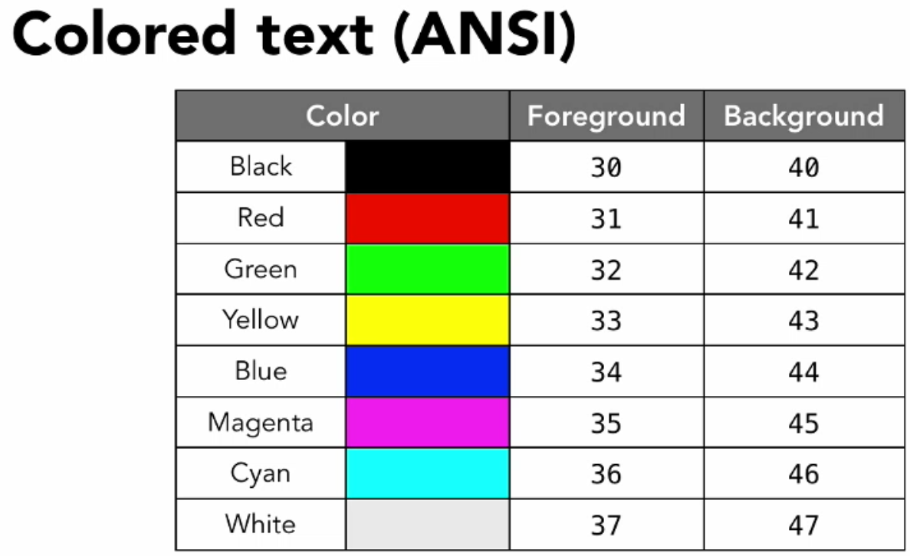
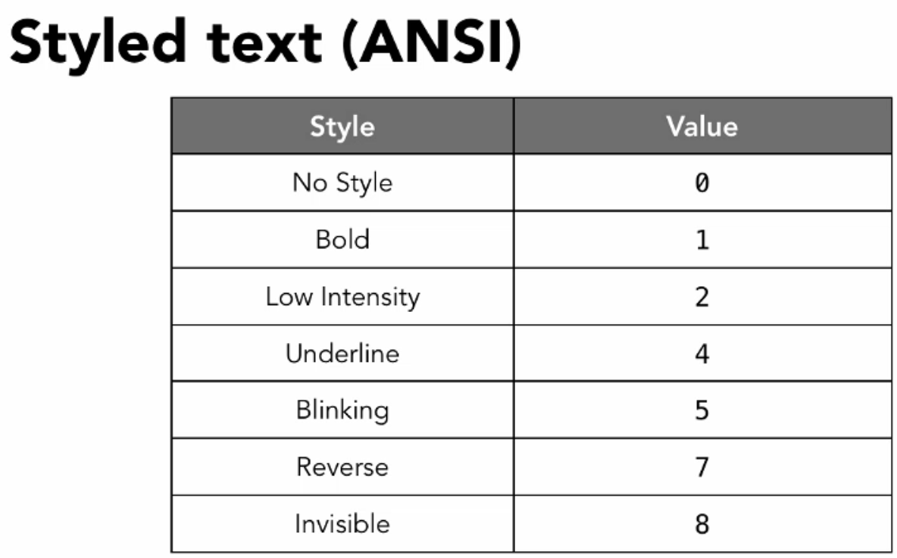

echo 是打印的基本命令 可以将内容打印到屏幕上，

<!--more-->

### 常用选项

-n
默认会打换行符到屏幕，本选项会阻止加入换行符

-e
默认原样输出，加入本选项后会对转义字符进行转义

### 说明

echo 的内容不用引号包括时，用分号或者换行符也可以表示结束，但是这种方法不能打印分号本身，也不能打印多个连续的空格。
echo 的内容用双引号包括时，可以原样输出，也可以解析变量，但是不能打印出转义字符，比如\!。
echo 的内容用单引号包括时，完完全全单原样输出。

一次性echo 多组内容也是可以的, 会用空格隔开他们。


### 补充
echo 也可以做一些简单的样式控制，虽然比不上print 那么强大，但也是足够精彩：echo 可以打印出不同颜色的字体。

格式是：`<Esc>[<FormatCode>m<output>`

`<Esc>` 就是 ^[ or <Esc> 也就是 用ascii码表示就是是 \033  \e  \x1b
`<FormatCode>` 就是对字符样式的控制码，比如字体颜色、背景颜色、动画等

最复杂的就是 `<style-code>;<foreground-code>;<background-code>` 

设置某种格式之后，接下来终端里所有打印出的字符都会遵守控制。注意 [和m中间不能有空格
比如:

```
echo -e "\e[32m绿色的字体哦\e[0m"
```

直观的颜色：




#### 两个有意思的脚本
这个告诉我们，原来可以这样用变量设置颜色
```bash
#! /usr/bin/bash
RED='\033[0;31m'
NC='\033[0m' # No Color
printf "I ${RED}love${NC} Stack Overflow\n"
```

这个脚本取名叫万花筒？
```bash
#! /usr/bin/bash
for code in {0..255}; do echo -e "\e[38;05;${code}m $code: Test"; done
for code in {30..49}; do echo -e "$i = \e[0;$[i++]m test color \e[m";done
```

### 参考
<http://misc.flogisoft.com/bash/tip_colors_and_formatting>
